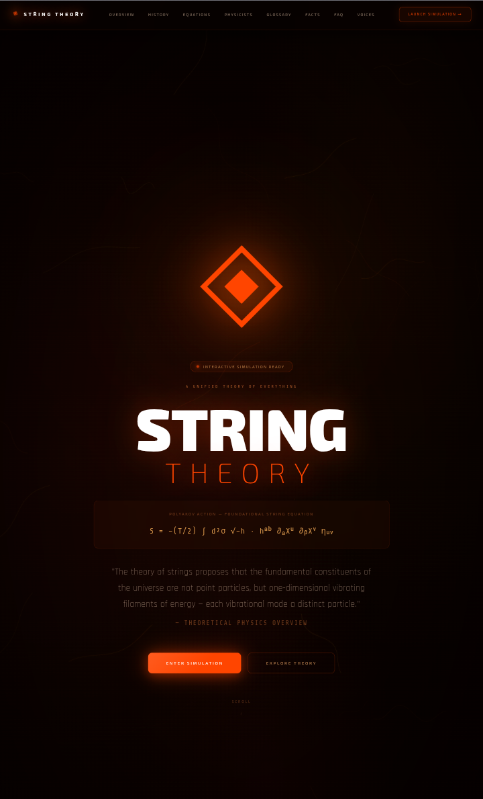

# STRING THEORY — Interactive Simulation

> *"If you thought physics was boring, you haven't seen it rendered at 60fps."*



**[🌌 Launch the Simulation →](https://nazat02.github.io/String-Theory-/)**

---

## Why Does This Exist?

String theory is arguably the most ambitious idea in the history of human thought. It claims that every particle — every electron, every photon, every quark that makes up everything you've ever touched — is not a point. It's a **vibrating loop of energy**, smaller than anything we can currently measure, oscillating at a specific frequency that determines what kind of particle it becomes.

That idea has been locked inside graduate-level textbooks for 50 years.

The equations exist. The papers exist. The Nobel laureates exist. What didn't exist — until now — was a way for a curious 16-year-old, a philosophy student, a software engineer, or just someone who watched a documentary once, to **actually see it.**

Not an animation. Not a cartoon. A genuine, physics-accurate, interactive simulation of the theory's core concepts — running in your browser, for free, forever.

That's why this exists.

---

## The Real Problem This Solves

Physics communication is broken.

Pop-science videos show you pretty CGI and tell you "strings vibrate." Textbooks show you pages of tensor calculus and tell you to derive it yourself. There is almost nothing in between — and that gap is where curiosity goes to die.

The gap is enormous. String theory sits at the intersection of quantum mechanics, general relativity, and geometry. It predicts extra dimensions, explains why gravity is so weak, provides the only known framework that unifies all four fundamental forces, and has generated more mathematical breakthroughs than any other field in theoretical physics over the last four decades. And most people know it as "that thing with tiny strings."

This project bridges that gap. Not by dumbing the physics down. By making the physics **visual, interactive, and immediate.**

---

## What You Can Actually Do Inside

The simulation has **11 interactive modules**, each visualising a distinct layer of the theory:

### 01 · Particles
Watch a string become a particle in real time. Select the Graviton, Photon, Gluon, Higgs Boson, Electron, Quark, W/Z Boson, or Dilaton — and see the exact vibrational mode, polarisation, and topology that produces each one. The same string, a different oscillation, a different particle. That is the central claim of string theory, rendered visually.

### 02 · Interactions
Particles in quantum field theory interact at mathematical points — and those points produce infinities that physicists have spent a century learning to ignore. String interactions have no points. Two strings merge smoothly, their worldsheets joining in a continuous surface. Watch the topology change. Watch the divergence disappear.

### 03 · Worldsheet
A string moving through spacetime sweeps out a 2D surface called a worldsheet. The Polyakov action — the equation that governs all of string physics — is an integral over this surface. This module renders the open string (strip), the closed string (cylinder), and the interaction (pair-of-pants topology) with live Euler characteristic readouts.

### 04 · Feynman vs. String
Side by side: a Feynman diagram with its point vertex producing UV divergence, against the equivalent string diagram — a smooth worldsheet with no vertex, no divergence. This visual alone answers the question physicists have been arguing about for decades: *why is string theory UV-finite?*

### 05 · Energy Levels
The quantum harmonic oscillator ladder, visualised for open strings, closed strings, and superstrings simultaneously. Ground state = known particles. First excited state = Planck-mass relics, ~10¹⁹ GeV, undetectable with any current or foreseeable collider. The hierarchy problem made visible.

### 06 · Extra Dimensions
String theory requires 10 spacetime dimensions (11 in M-theory). The extra 6 are compactified — curled into structures so small they're invisible at any energy we can probe. Three compactification geometries are animated here: the Calabi-Yau manifold (whose topology determines the gauge group and number of particle generations), the torus T⁶, and the circle S¹ with T-duality visualised.

### 07 · D-Branes
Open strings don't float freely in spacetime. Their endpoints are pinned to dynamical objects called D-branes. Drag the brane. Watch the strings stretch, tension, and snap. N coincident D3-branes host a U(N) gauge theory on their worldvolume — and in the limit N→∞, that's the foundation of the AdS/CFT correspondence.

### 08 · AdS/CFT
The holographic principle, animated. A 5-dimensional Anti-de Sitter bulk with a black hole interior, dual to a 4-dimensional conformal field theory on its boundary. Gravitons propagating in the bulk correspond to stress tensor excitations in the CFT. The duality is shown live: bulk geometry on the left, boundary field theory on the right.

### 09 · Superstrings
The five consistent superstring theories — Type I, Type IIA, Type IIB, Heterotic E₈×E₈, Heterotic SO(32) — with their string content, supersymmetry, gauge groups, and duality relations. This is where bosons and fermions unify. The fermionic oscillator ground state is visualised alongside the bosonic sector.

### 10 · String Landscape
~10⁵⁰⁰ metastable vacua. Each one a possible universe with different physical constants, different particle masses, a different value of the cosmological constant. Bubble nucleation animations show how quantum tunnelling connects them. This is the deepest and most controversial prediction of string theory — and it's rendered in real time.

### 11 · M-Theory
The 11-dimensional framework that unifies all five superstring theories as limiting cases. The duality web is interactive: T-duality, S-duality, compactification on S¹ and S¹/ℤ₂. M2 and M5 branes. The opening of the 11th dimension at strong coupling. The full picture.

---

## Why This Is Necessary

### Because the tools we use to teach physics are 200 years old

Blackboards. Textbooks. Lectures. These are the dominant pedagogical technologies of theoretical physics in 2024. They are adequate for transmitting equations. They are catastrophically inadequate for transmitting intuition.

Intuition in physics comes from seeing things move. From manipulating them. From breaking them and watching what happens. Every working physicist has a mental movie of the phenomena they study — the fields, the topologies, the symmetries. Students spend years building that movie from equations alone. Most don't make it.

Interactivity collapses that timeline.

### Because string theory specifically suffers from a visualisation deficit

General relativity has gravitational wave detectors, black hole photographs, GPS satellites. Quantum mechanics has the double-slit experiment, scanning tunnelling microscopes, lasers. Every other major theory of physics has physical, tangible phenomena you can point to.

String theory's predictions operate at the Planck scale — 10⁻³⁵ metres, 10¹⁹ GeV. We cannot build an accelerator large enough to probe it directly. The theory's physical content lives almost entirely in mathematics. Visualisation is not optional for string theory education. It is the only available tool.

### Because the public deserves to understand what their civilisation is working on

String theory has absorbed the professional energy of thousands of the most talented physicists alive for over 50 years. It has produced the AdS/CFT correspondence — one of the most productive ideas in the history of mathematical physics, with applications ranging from condensed matter to quantum information to black hole thermodynamics. It has generated breakthroughs in algebraic geometry, number theory, and topology that have nothing to do with physics at all.

The public funds this research. The public has a right to access it — not in press releases, not in oversimplified metaphors, but in genuine, honest, interactive engagement with the actual ideas.

---

## Technical Implementation

**Rendering:** Three.js WebGL for all 3D simulations (Particles, Worldsheet, D-Branes, Superstrings, M-Theory, Landscape). Custom Canvas 2D for Feynman diagrams, Energy Levels, Extra Dimensions, and AdS/CFT dual-panel rendering.

**Physics accuracy:**
- String vibration modes computed from standing wave equations with correct harmonic numbers
- Worldsheet topology changes use correct Euler characteristic (χ = 0 for cylinder, χ = −1 for pair-of-pants)
- Superstring theory data (gauge groups, SUSY charges, brane content) sourced from standard references
- AdS/CFT dual pairs match the published dictionary (graviton ↔ stress tensor, etc.)
- Calabi-Yau, torus, and circle compactifications geometrically accurate at the topological level

**No dependencies beyond Three.js.** Pure HTML, CSS, JavaScript. No build step. No framework. Opens instantly in any browser on any device.

**Mobile-first responsive design.** Every module adapts to phone screens. Physics education shouldn't require a desktop.

---

## The Honest Disclaimer

String theory is not experimentally confirmed. It is a theoretical framework — extraordinarily mathematically rich, internally consistent, and productive — but it has not produced a falsifiable prediction that has been tested and verified at the time of writing.

This simulation presents the theory's concepts accurately and honestly. It does not claim the theory is true. It claims the theory is worth understanding — and it is, regardless of whether it describes our universe, because the mathematics it has generated has transformed multiple fields and the ideas it contains are among the most remarkable in human intellectual history.

Engage critically. The physics is real. The confirmation is still pending.

---

## Sections in the Landing Page

Beyond the simulation, the landing page documents:

- **Historical Timeline** — from Veneziano's dual resonance model (1968) through Green-Schwarz anomaly cancellation (1984), the second superstring revolution (1995), AdS/CFT (1997), to current research directions
- **Core Equations** — Polyakov action, mass spectrum, Regge trajectories, beta function
- **Key Physicists** — Veneziano, Schwarz, Green, Polchinski, Witten, Maldacena
- **Glossary** — 20+ terms from tachyon to T-duality to moduli stabilisation
- **FAQ** — honest answers to the hard questions: Is string theory science? Why 10 dimensions? What would falsify it?

---

## Running Locally

```bash
git clone https://github.com/nazat02/String-Theory-.git
cd String-Theory-
# Open index.html in any browser. No server required.
open index.html
```

Or with a local server:

```bash
python3 -m http.server 8000
# Visit http://localhost:8000
```

---

## Contributing

Contributions are welcome and needed. Priority areas:

- **Physics review** — if you spot an inaccuracy in the simulation parameters or descriptive text, open an issue. Accuracy matters.
- **New modules** — candidates include: Regge trajectories, string scattering amplitudes, black hole entropy (Bekenstein-Hawking), mirror symmetry
- **Accessibility** — keyboard navigation, screen reader support, reduced-motion alternatives
- **Translations** — the landing page content should exist in every major language

Open an issue before starting major work so we can coordinate.

---

## License

MIT. Use it, fork it, teach with it, build on it. If you use it in an educational context, a mention would be appreciated but is not required.

---

## A Final Note

There is a version of the future where every high school student can spend 20 minutes with a simulation like this and walk away with a genuine intuition for why physicists believe spacetime might have 11 dimensions, why point particles cause mathematical infinities and strings don't, and what it would mean if everything in the universe is made of the same object vibrating differently.

That future is worth building toward.

This is one step.

---

<div align="center">

**[🌌 Open the Simulation](https://nazat02.github.io/String-Theory-/)**

*Built with Three.js · Pure HTML/CSS/JS · No build step · Mobile ready*

*If this helped you understand something you didn't before — that's the whole point.*

</div>
